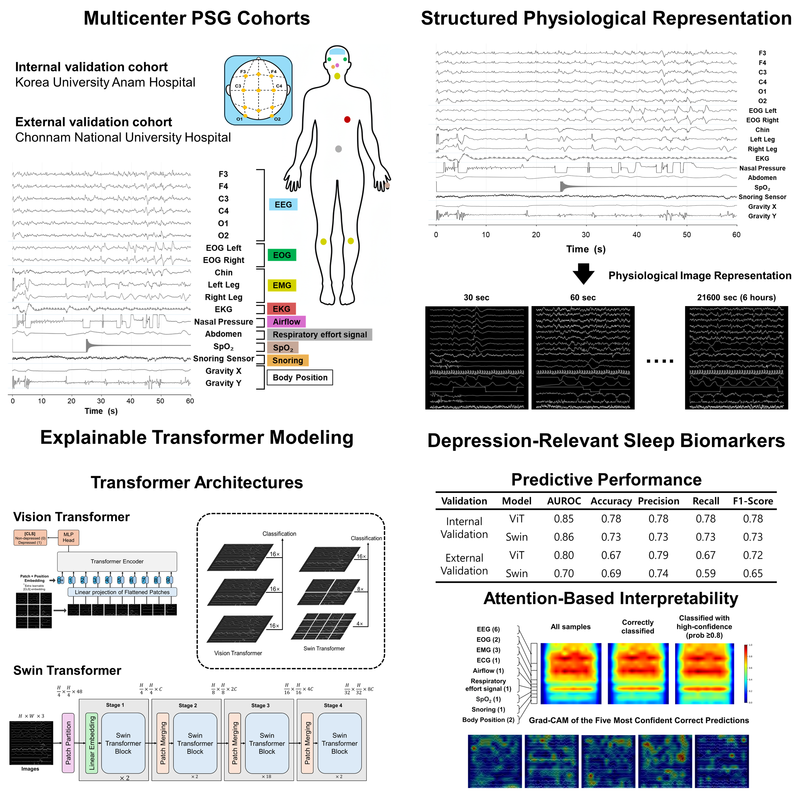

# Polysomnography-Based Classification of Clinically Significant Depressive Symptoms Using Explainable Deep Learning

This repository contains the code required to reproduce the core pipeline of the study: the
conversion of raw polysomnography (PSG) recordings into waveform images, and the
training of the two image-based Transformer classifiers (Vision Transformer and
Swin Transformer).

---

## Framework Overview 

---

## Repository contents

| Path | Description |
|---|---|
| `preprocessing/edf_to_images.py` | EDF → 224 × 224 epoch images. Complete preprocessing and rendering in a single pass; no intermediate files. |
| `preprocessing/requirements.txt` | Dependency ranges for the preprocessing stage. |
| `preprocessing/README.md` | Preprocessing usage and step-by-step execution notes. |
| `train/ViT/train_vit.py` | Vision Transformer training and participant-level evaluation. |
| `train/ViT/requirements.txt` | Dependency ranges for the ViT training stage. |
| `train/ViT/README.md` | ViT setup, options, and outputs. |
| `train/Swin/train_swin.py` | Swin Transformer training and participant-level evaluation. |
| `train/Swin/requirements.txt` | Dependency ranges for the Swin training stage. |
| `train/Swin/README.md` | Swin setup, options, and outputs. |
| `img/` | Figures referenced by the README files. |
| `LICENSE` | License terms. |

---
